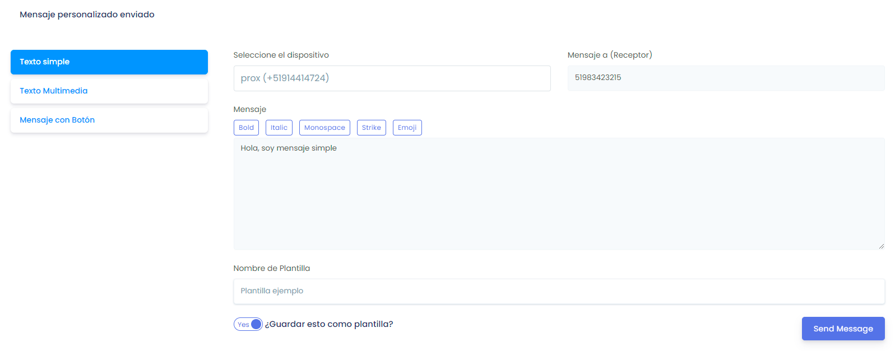
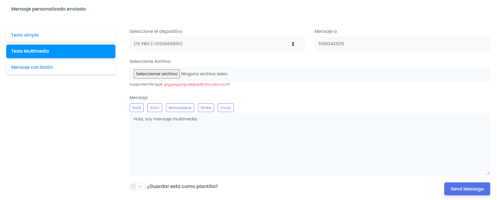
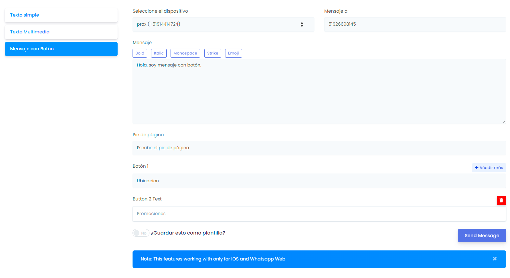

# Envíos Simples

### Haz envíos individuales a cualquier número

<iframe width="100%" height="505" src="https://www.youtube.com/embed/_VyiLs_9ZGM" title="YouTube video player" frameborder="0" allow="accelerometer; autoplay; clipboard-write; encrypted-media; gyroscope; picture-in-picture; web-share" allowfullscreen></iframe>

:::info NOTA:
Selecciona el botón deslizable **¿Guardar esto como plantilla?**, en caso de que desees volver a usar el mensaje.
:::

Ingresa a el módulo **Envío Simple**, y visualizarás las diferentes opciones de envio de mensajes personalizados.

1. **Texto Simple:**

      1. Seleccione el dispositivo.
      2. Seleccione el contacto.
      3. Escriba el mensaje, puede añadirle formato y emojis.
      4. Envía el mensaje.

2. **Texto Multimedia:**

      1. Seleccione el dispositivo.
      2. Seleccione el contacto.
      3. Seleccione el archivo multimedia(imagen/video)
      4. Escriba el mensaje, puede añadirle formato y emojis.
      5. Envía el mensaje.

3. **Mensaje con Botón:**

      1. Seleccione el dispositivo.
      2. Seleccione el contacto.
      3. Escriba el mensaje, puede añadirle formato y emojis.
      4. Escriba un pie de página.
      5. Añada botones o respuestas rápidas.
      6. Envía el mensaje.

:::danger IMPORTANTE:
El mensaje con botón solo funciona solo para **IOS y Whatsapp Web**.
:::

